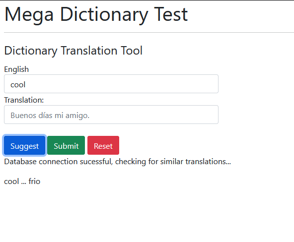

# Mega-Dictionary-Test
    Time spent: 6 hours.
# Build Instructions
1. Download [XAMPP 8.1.4](https://www.apachefriends.org/download.html)
2. Place the mdt folder in xampp/htdocs/
3. Start Apache and MySQL with the XAMPP console
4. Import the MySQL table dump provided at phpmyadmin_sql_dump.txt
5. Access the application via [localhost/mdt](http://localhost/mdt/)

# Todo:
-   Use a client-side validation library (like validate.js) to clean submitted data on the client-side, before making POST request.
-    Fix up the suggest functionality to split multi-word strings and suggest all at once - currently only single word is supported
# Note:
This application utilizes XAMPP and so is not secure for production/deployment.

# Test Criteria
-	The system should use a MySQL database for storage

    XAMPP and other AMP packages have phased out MySQL in favour for MariaDB since at least PHP version 5. This project uses Maria behind the scenes, with 1:1 interoperability.

-	It should support one language other than English

    The program uses UTF8 to facilitate languages that use more characters than plain ASCII (English) script. Function variables could be adapted from "spanishText" to "destinationLangText" or other generic name to support more languages in the future.

-	The main screen should show two boxes, one for the English text, one for another language

    Achieved :) See index.html
-	We should be able to create new English phrases to load into the dictionary in the database.
-	We should be able to create translations in another language for each English phrase in the database.

    <figure>
    
    <figcaption>Create phrase and translation</figcaption>
    </figure>

    Due to time constraints, this must be done at the same time as loading an English phrase, but a seperate function to SELECT english words with no corresponding translation would be a great addition.

-	The main screen should display suggested translated phrases when it picks up an English phrase in the English text

    <figure>
    
    <figcaption>Suggest button working with a full, single word</figcaption>
    </figure>

    <figure>
    
    <figcaption>Partial matches also supported</figcaption>
    </figure>

    In progress - uses the 'Suggest' button to send an AJAX request. I did not have time to create functionality similar to Google translate's real-time autocomplete. There is also a bug where a multi-word strings are not exploding correctly, to make a suggestion for every word present, at once.

-	The system should support character entry and storage for all major languages

    Achieved - Uses UTF8 encoding, which should tick this box!

